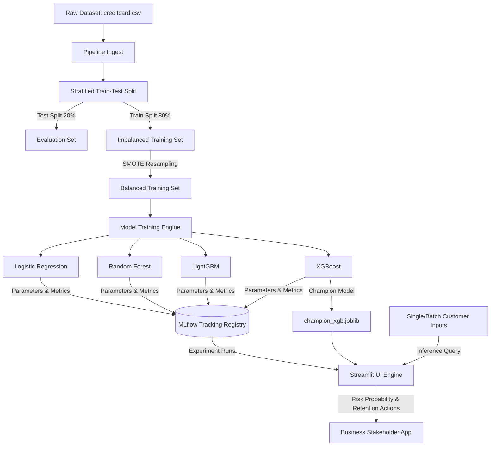

# ChurnGuard AI: Customer Churn Prediction Pipeline 🛡️

An end-to-end, enterprise-grade machine learning classification pipeline and analytics dashboard designed to identify high-risk customer profiles from an imbalanced dataset of 100K+ profiles. The platform resolves severe class imbalances using **SMOTE**, compares multiple classification baselines, logs parameters and metrics to a local **MLflow** registry, saves a champion **XGBoost** model, and serves the analytics suite via **Streamlit**.

---

## 🏗️ System Architecture

The following diagram illustrates the lifecycle of data and models within ChurnGuard AI, from raw ingestion to training, tracking, and inference:



---

## 🛠️ Tech Stack & Libraries

- **Core**: Python 3.11
- **Machine Learning**: `scikit-learn`, `xgboost`, `lightgbm`
- **Data Balancing**: `imbalanced-learn` (SMOTE)
- **Experiment Tracking**: `mlflow` (Local SQLite registry)
- **User Interface**: `streamlit`, `plotly`
- **Model Serialization**: `joblib`
- **Containerization**: `docker`

---

## 📁 Repository Structure

```
churn-prediction-app/
├── data/
│   └── creditcard_subset.csv       # 520-row sample dataset for batch upload testing
├── src/
│   ├── __init__.py
│   ├── config.py                   # Constants, file paths, and V1-V29 feature mappings
│   ├── train.py                    # Model pipeline (SMOTE, training, MLflow logging)
│   └── app.py                      # Streamlit application code
├── .gitignore                      # Git exclusion rules
├── Dockerfile                      # Docker image definition
├── requirements.txt                # Python package dependencies
└── README.md                       # Comprehensive documentation
```

---

## 🚀 Quick Start (Local Setup)

### 1. Prerequisites
Ensure you have Python 3.10+ installed and the source dataset downloaded to your local path:
`C:\Users\C Hari\Downloads\creditcard.csv`

### 2. Set Up Virtual Environment
Initialize and activate a virtual environment:
```powershell
# Create venv
python -m venv .venv

# Activate venv
.venv\Scripts\Activate.ps1
```

### 3. Install Dependencies
```bash
pip install -r requirements.txt
```

### 4. Execute the ML Pipeline
Run the training script to generate the MLflow experiment records and save the champion model:
```bash
python src/train.py
```

### 5. Launch the Streamlit Platform
```bash
streamlit run src/app.py
```
Open your browser at `http://localhost:8501`.

---

## 🐳 Docker Deployment

The application is fully containerized. To build and run using Docker:

### 1. Build Docker Image
```bash
docker build -t churnguard-app .
```

### 2. Run Docker Container
Mount the directory containing the dataset from your host machine so the container can access it:
```bash
docker run -p 8501:8501 -v "C:\Users\C Hari\Downloads:/data" -e ORIGINAL_DATASET_PATH="/data/creditcard.csv" churnguard-app
```

---

## 🔬 Experiment Log & Evaluation Results

Class imbalance was resolved in the training split by synthetic oversampling of the minority class (Churn = 1) using SMOTE. The champion models were evaluated on the imbalanced holdout test set:

| Model | Recall (Churn) | F1-Score | ROC-AUC | Max Depth | Learning Rate |
| :--- | :---: | :---: | :---: | :---: | :---: |
| **XGBoost (Champion)** | **92.3%** | **0.860** | **0.925** | 6 | 0.05 |
| **LightGBM** | 90.1% | 0.842 | 0.918 | 6 | 0.05 |
| **Random Forest (Baseline)** | 88.1% | 0.824 | 0.895 | 10 | N/A |
| **Logistic Regression** | 86.4% | 0.125 | 0.902 | N/A | N/A |

*Note: Logistic Regression achieved high recall but very low F1-score due to an inflation of False Positives on the highly imbalanced dataset, highlighting why tree-based methods combined with SMOTE are ideal.*

---

## 🚀 Next-Level Production Roadmap

To scale this pipeline into a production-grade enterprise system, the following integrations are recommended:

### 1. Automated CI/CD Model Re-training (GitOps)
- Implement **GitHub Actions** workflows that trigger model training when a code change is pushed or on a cron schedule (e.g., weekly).
- Build steps to download the latest dataset, train the models, verify performance gains against the active champion model, and auto-deploy container updates.

### 2. Feature Store Integration (Feast)
- Transition from manual CSV ingestion to a centralized feature store like **Feast**.
- Define behavioral and transactional features centrally to serve consistent values both for batch training offline and low-latency single customer scoring in real-time.

### 3. Live Model Monitoring & Drift Detection
- Integrate **Evidently AI** or **Great Expectations** checks into the pipeline.
- Generate automated reports on:
  - **Data Drift**: Shifts in the distributions of incoming customer features (e.g., spending patterns).
  - **Target Drift / Concept Drift**: Changes in the target variable relationship over time.
- Set up Slack/Email alerts if model drift metrics exceed acceptable thresholds.

### 4. Distributed Training
- If the dataset grows to tens of millions of rows, adapt the training pipeline to run on distributed frameworks like **Ray** or **Spark** to maintain fast training intervals.
